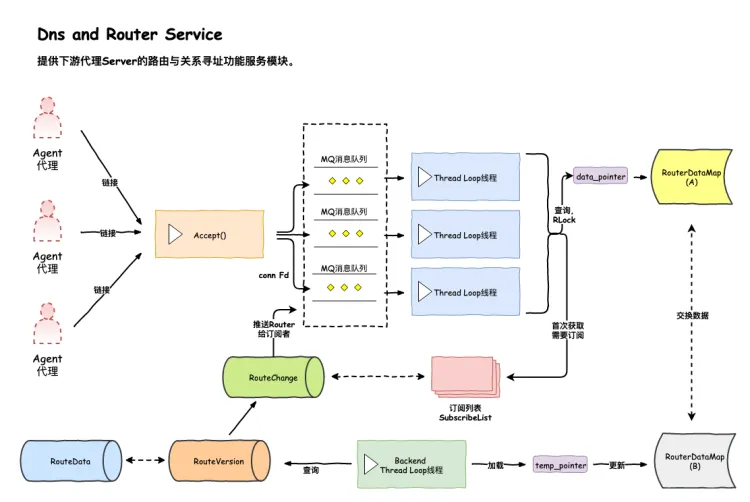

# 问题记录

1. 大量内存泄漏问题（1）connection断开后，没有释放connection(已解决)重新设计connection所有权，添加EPOLLRDHUP事件
2. 原本链接分配问题（已解决）
   代码小问题，将任务均匀分配到给线程任务队列

# 总体技术栈

Protobuf Liunx网络编程 C++ STL 一致性哈希 Mysql 

# 总体架构

一个服务可以被抽象为命令字：modid+cmdid的组合，称为一个模块，而这个服务往往有多个服务节点，其所有服务节点的地址集合被称为这个模块下的路由，节点地址简称为节点

一个Lars系统包含一个DNSService，一个Report Service，以及部署于每个服务器的LoadBalance Agent，业务代码通过API与ELB系统进行交互

# reactor架构

## 设计

### 整体架构

整体采用主从Reactor和one thread one eventloop的架构，主Ractor负责Accept和分发连接,从Reactor负责处理连接的网络事件，从Reactor由线程池管理

### 任务队列设计

这里采用任务队列和EPOLL结和的方式，有任务放入队列时，写入eventfd触发对应事件和处理函数，处理函数中会获取对应的队列并取出任务开始执行，这里的任务以一种结构体抽象表示（包括任务类型，对应函数，对应参数等）

### 线程池设计

本次线程池设计与以往不同，忽略模块高耦合，将线程池直接与event_loop结合（线程主函数直接包含loop->event_process()），且每一个线程都有自己的任务队列，降低线程间锁竞争，增加扩展性，但负载均衡没有实现，考虑到本项目中任务单一，各线程执行时间基本相同，故只采用轮询的方式添加任务

### 内存池设计

内存池设计为单例模式，首先还是对buf进行一个简单的封装，在内存池初始化时，预先分配不同大小（4K、16K、64K、256K、1M、4M、8M）的内存块，每种申请多个，总容量为5G，采用哈希表和链式存储这些内存块，申请内存时，按大小找到合适的大小，然后分配对应的内存块，如果内存块用完，但总容量小于最大限制则创建新的内存块，用完后重新挂到对应的链表上。

### 新链接处理流程

首先主reactor就是一个线程，注册accept_callback回调函数，当然当连接事件到达时，触发主loop的EPOLLIN事件并触发对应的事件（这里就是accept），在回调函数中会调用accept函数取出全连接队列中的连接，并创建连接任务，放入从reactor的任务队列中（轮询选取），触发从reatcor的事件并创建connection，注册fd和对应的回调函数进epoll中。

### 消息处理流程

消息就绪后，首先会让epoll_wait返回，并触发对应的读事件的回调函数，这里就是上面创建连接时注册的函数，这里是connection中的读函数，在该函数中会读取的所有的信息到ibuf中，然后读取消息的msgid，然后触发对应的回调函数，这里的函数都注册在server的router中。

### udp server设计
udp也使用epoll但是udp server中只有一个线程

## 性能测试

### 测试环境
系统：centos 8  
cpu：2核  
内存：2G  
网络：峰值速度 300kb/s

### tcp Echo server QPS测试
| 线程数  | 并发连接数 | QPS |
|--------|-----------|-----|
|1        |  10      |   13w  |
|1        |  40      |   13w  |
|2        |  10      |   16w  |
|2        |  40      |   16w  |
|4        |  10      |   16w  |
|4        |  40      |   16w  |
|8        |  10      |   16w  |
|8        |  40      |   16w  |

## 待改进方面

# DNS Service
负责接收各agent对某modid、cmdid的请求并返回该modid、cmdid下的所有节点，即为agent提供获取路由服务

## 网络模型
DnsService服务模型采用了one loop per thread TCP服务器，主要是基于前面开发的Reactor模型：

## 框架流程
1.  服务启动时，RouteData表被加载到data_pointer指向的RouterDataMap_A中, temp_pointer指向的RouterDataMap_B为空 
2.  服务启动后，agent发来Query for 请求某modid/cmdid，到其所在Thread Loop上，上读锁查询data_pointer指向的RouterDataMap_A，返回查询结果； 
3.  如果此modid/cmdid不存在，则把agent ip+port+moid/cmdid发送到Backend thread loop1的队列，让其记录到ClientMap

## Route的订阅与广播

### 订阅流程
当有新的查询消息到来时，会把对应的mod和连接fd加入本链接的订阅链表和全局订阅哈希桶链表

### 广播流程
当需要进行广播时，调用的是publish(std::vector<uint64_t> &change_mods)函数，change_mods表示的是修改的mod的集合，首先会判断这些mod是否在订阅表中，如果在就加入_push_list中（这里的_push_list的key为fd），然后推送任务给从reactor线程（这里是推送给全部线程，因为不知道要发布的fd在那个线程里面，只好丢给线程自己去判断），然后再对应的线程中，会先找到直接包含的fd（make_publish_map函数），然后查询对应的mod，依次发送消息。

## 后台更新线程
更新线程函数为check_route_changes，目前暂定一秒钟查询一次，首先会获取最新版本号，如果有更新则会重新读取数据表并更新，然后读取修改表,把修改的数据进行广播通讯，这里还有个超时时间，超时也会自动更新一次。

# report service
负责接收各agent（代理服务器）对某modid、cmdid下节点的调用状态的上报。agent会把代理的host节点的状态上报给Reporter，Reporter负责存储在Mysql数据库中。

## 主框架流程
Reporter服务模型采用了single thread TCP服务器 + 线程池处理请求

●  主线程Reporter负责接收agent请求，并根据请求中携带的modid和cmdid，拼接后进行murmurHash（一致性hash），分配到某个线程的MQ上 
●  Thread 1~N们负责处理请求：把MQ上的请求中的数据同步更新到MySQL数据表
由于agent上报给Reporter的信息是携带时间的，且仅作为前台展示方便查看服务的过载情况，故通信仅有请求没有响应 

于是Reporter服务只要可以高效读取请求即可，后端写数据库的实时性能要求不高。

# LoadBalance Agent

一个服务称为一个模块，一个模块由modid+cmdid来标识
modid+cmdid的组合表示一个远程服务，这个远程服务一般部署在多个节点上

## 节点获取服务

业务方每次要向远程服务发送消息时，先利用modid+cmdid去向LB Agent获取一个可用节点，然后向该节点发送消息，完成一次远程调用；具体获取modid+cmdid下的哪个节点是由LB Agent负责的

## 节点调用上报服务

对LB Agent节点的一次远程调用后，调用结果会汇报给LB Agent，以便LB Agent根据自身的LB算法来感知远程服务节点的状态是空闲还是过载，进而控制节点获取时的节点调度.

LB Agent拥有5个线程，一个LB算法：

UDP Server服务，并运行LB算法，对业务提供节点获取和节点调用结果上报服务；为了增大系统吞吐量，使用3个UDP Server服务互相独立运行LB算法：modid+cmdid % 3 = i的那些模块的服务与调度，由第i+1个UDP Server线程负责

Dns Service Client：是dnsserver的客户端线程，负责根据需要，向dnsserver获取一个模块的节点集合（或称为获取路由）；UDP Server会按需向此线程的MQ写入获取路由请求，DSS Client将MQ到来的请求转发到dnsserver，之后将dnsserver返回的路由信息更新到对应的UDP Server线程维护的路由信息中

Report Service Client：是reporter的客户端线程，负责将每个模块下所有节点在一段时间内的调用结果、过载情况上报到reporter Service端，便于观察情况、做报警；本身消费MQ数据，UDP Server会按需向MQ写入上报状态请求。

### 负载均衡算法

● Load Balance从空闲队列拿出队列头部节点，作为选取的节点返回，同时将此节点重追到队列尾部；
● probe机制 ：如果此模块过载队列非空，则每经过probe_num次节点获取后（默认=10），给过载队列中的节点一个机会，从过载队列拿出队列头部节点，作为选取的节点返回，让API试探性的用一下，同时将此节点重追到队列尾部；
● 如果空闲队列为空，说明整个模块过载了，返回过载错误；且也会经过probe_num次节点获取后（默认=10），给过载队列中的节点一个机会，从过载队列拿出队列头部节点，作为选取的节点返回，让API试探性的用一下，同时将此节点重追到队列尾部；
